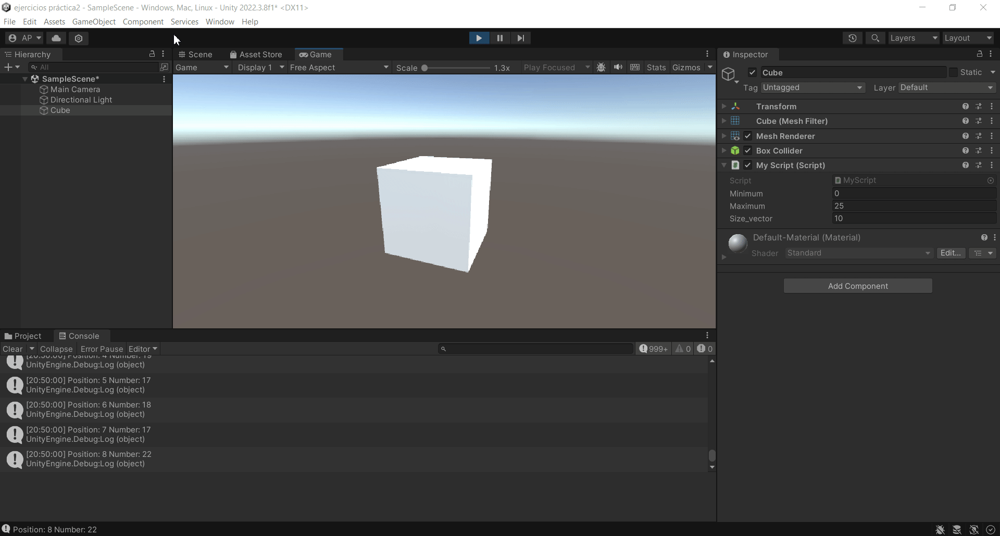

# Practica2-InterfacesInteligentes
## Introducción C# - Scripts
### Alicia Guadalupe Cruz Pérez
Se han realizado varios ejercicios de script en unity:

- **a) Se pide crear un script asociado al cubo que inicialice un array a un conjunto de valores numéricos aleatorios entre 0 y 25. En cada frame se debe cambiar una posición aleatoria y mostrar en pantalla en la consola los que sean mayores que 15. Parametrizando el rango para poderlo cambiar desde el inspector.**

Para ello se han seguido los siguientes pasos:
1. Creación del objeto 3D básico (cubo).
2. Creación de un [script](scripts/ejercicio1_script.cs) asociado a cubo.
   
Dentro del script:

1. Creación de tres variables públicas para su posible cambio desde el inspector (minimum, maximum, size_vector).
2. Inicialización del arreglo (numbers) con un tamaño específico.
3. Asignación aleatoria de valores al arreglo en la función Start().
4. Generación de una posición aleatoria en el arreglo (random_position).
5. Generación de un nuevo número aleatorio (new_number).
6. Reemplazo del número en la posición aleatoria con el nuevo número en el arreglo.
7. Bucle para verificar números mayores que 15 en el arreglo y mostrarlos en la consola de Unity (Debug.Log()).

  

- **b) Se pide crear una escena simple en la que se ubique un plano y sobre él un cubo, una esfera y un cilindro. Cada uno de los objetos debe estar en un color diferente. En la consola cada objeto debe mostrar su nombre.**

Para ello se han seguido los siguientes pasos:
1. Creación de dos objetos 3D básicos nuevos (esfera y cilindro).
2. Creación de una carpeta **Materials** dentro de la carpeta **Assets**.
3. Creación, nombramiento y asignación de cada material a un objeto distinto.
4. Creación de un [script](scripts/ejercicio2_script.cs) asociado a un objeto vacío (printName).
5. En el inspector de dicho objeto, asignación de cada objeto a su variable correspondiente.

Dentro del script:

1. Declaración de variables públicas para referenciar objetos en Unity (plane, cube, sphere, cylinder).
2. Acceso al nombre de los objetos (plane, cube, sphere, cylinder)  y mostración en la consola usando Debug.Log().

  

- **c) Se pide crear un script asociado a la esfera con dos variables Vector3 públicas. Darle valor a cada componente de los vectores desde el inspector. Se debe mostrar en la consola:**
   + **La magnitud de cada uno de ellos.**
   + **El ángulo que forman.**
   + **La distancia entre ambos.**
   + **Un mensaje indicando qué vector está a una altura mayor.**
   + **Muestra en el inspector cada uno de esos valores.**
