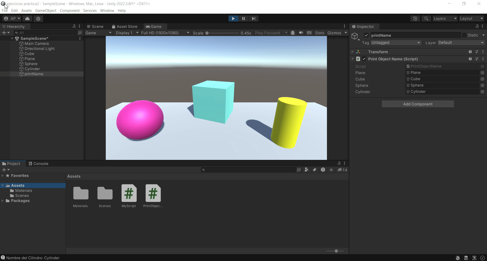

# Practica2-InterfacesInteligentes
## Introducción C# - Scripts
### Alicia Guadalupe Cruz Pérez
Se han realizado varios ejercicios de script en unity:

- **a) Se pide crear un script asociado al cubo que inicialice un array a un conjunto de valores numéricos aleatorios entre 0 y 25. En cada frame se debe cambiar una posición aleatoria y mostrar en pantalla en la consola los que sean mayores que 15. Parametrizando el rango para poderlo cambiar desde el inspector.**

Para ello se han seguido los siguientes pasos:
1. Creación del objeto 3D básico (cubo).
2. Creación de un [script](scripts/ejercicio1_script.cs) asociado a cubo.
   
Dentro del script:

1. Creación de tres variables públicas para su posible cambio desde el inspector (minimum, maximum, size_vector).
2. Inicialización del arreglo (numbers) con un tamaño específico.
3. Asignación aleatoria de valores al arreglo en la función Start().
4. Generación de una posición aleatoria en el arreglo (random_position).
5. Generación de un nuevo número aleatorio (new_number).
6. Reemplazo del número en la posición aleatoria con el nuevo número en el arreglo.
7. Bucle para verificar números mayores que 15 en el arreglo y mostrarlos en la consola de Unity (Debug.Log()).

  

- **b) Se pide crear una escena simple en la que se ubique un plano y sobre él un cubo, una esfera y un cilindro. Cada uno de los objetos debe estar en un color diferente. En la consola cada objeto debe mostrar su nombre.**

Para ello se han seguido los siguientes pasos:
1. Creación de dos objetos 3D básicos nuevos (esfera y cilindro).
2. Creación de una carpeta **Materials** dentro de la carpeta **Assets**.
3. Creación, nombramiento y asignación de cada material a un objeto distinto.
4. Creación de un objeto vacío (printName).
5. Creación de un [script](scripts/ejercicio2_script.cs) asociado a dicho objeto vacío (print Object Name).
6. En el inspector de dicho objeto, asignación de cada objeto a su variable correspondiente.

Dentro del script:

1. Declaración de variables públicas para referenciar objetos en Unity (plane, cube, sphere, cylinder).
2. Acceso al nombre de los objetos (plane, cube, sphere, cylinder) y muestra en la consola usando Debug.Log().

  

- **c) Se pide crear un script asociado a la esfera con dos variables Vector3 públicas. Darle valor a cada componente de los vectores desde el inspector. Se debe mostrar en la consola:**
   + **La magnitud de cada uno de ellos.**
   + **El ángulo que forman.**
   + **La distancia entre ambos.**
   + **Un mensaje indicando qué vector está a una altura mayor.**
   + **Muestra en el inspector cada uno de esos valores.**

Para ello se han seguido los siguientes pasos:
1. Creación de un [script](scripts/ejercicio3_script.cs) asociado al objeto esfera (Ejercicio_3).
2. Asignación de valores a cada componente de los vectores en el inspector.

Dentro del script:

1. Declaración de variables públicas para los vectores **vectorA** y **vectorB**.
2. Cálculo de la magnitud del vectorA utilizando **vectorA.magnitude**.
3. Cálculo de la magnitud del vectorB utilizando **vectorB.magnitude**.
4. Cálculo del ángulo entre vectorA y vectorB utilizando **Vector3.Angle**.
5. Cálculo de la distancia entre los puntos resultantes de sumar vectorA y vectorB a la posición del objeto al que pertenece el script utilizando **Vector3.Distance**.
6. Determinación de qué vector está más alto comparando las coordenadas de ambos vectores.
7. Muestra de los cálculos realizados en la consola utilizando **Debug.Log()**.

  

- **d) Se pide mostrar en pantalla el vector con la posición de la esfera.**

Para ello se han seguido los siguientes pasos:
1. Creación de un [script](scripts/ejercicio4_script.cs) asociado al objeto esfera (Ejercicio_4).

Dentro del script:

1. Acceso a la posición del objeto al que pertenece el script utilizando **transform.position**.
2. Muestra de la posición de la esfera en la consola usando Debug.Log().

  

- **e) Se pide crear un script para la esfera que muestre en consola la distancia a la que están el cubo y el cilindro.**

Para ello se han seguido los siguientes pasos:
1. Creación de un [script](scripts/ejercicio5_script.cs) asociado al objeto esfera (Ejercicio_5).
2. Asignación a cada objeto de una etiqueta identificativa.

Dentro del script:
1. Búsqueda de objetos con las etiquetas "Cube" y "Cylinder" en la escena utilizando **GameObject.FindWithTag()**.
2. Verificación de si se encontraron los objetos (cube y cylinder) utilizando una declaración if.
3. Obtención del componente "Transform" de los objetos cube y cylinder.
4. Obtención de las posiciones de los objetos cube y cylinder utilizando **Transform.position**.
5. Cálculo de la distancia entre el objeto al que pertenece el script y el objeto cube utilizando **Vector3.Distance()**.
6. Cálculo de la distancia entre el objeto al que pertenece el script y el objeto cylinder utilizando **Vector3.Distance()**.
7. Cálculo de la distancia entre los objetos cube y cylinder utilizando **Vector3.Distance()**.
8. Muestra de las distancias calculadas en la consola utilizando **Debug.Log()**.
9. Si no se encuentran objetos con las etiquetas "Cube" o "Cylinder", muestrabde un mensaje de error en la consola utilizando **Debug.LogError()**.

  

- **f) Se pide crear un script que alinee el cilindro y el cubo con la esfera, 5 unidades a derecha e izquierda respectivamente en el eje X. Probar a cambiar la coordenada x de la posición de la esfera en el Inspector de Objetos.**

Para ello se han seguido los siguientes pasos:
1. Creación de un [script](scripts/ejercicio6_script.cs) asociado al objeto esfera (Ejercicio_6).
2. Asignación de los objetos "Cube" y "Cylinder" en el Inspector del objeto que contiene dicho script.

Dentro del script:
1. Acceso a la posición actual del objeto al que pertenece el script utilizando **transform.position**.
2. Creación de un nuevo vector (new Vector3(5f, 0f, 0f)) que representa un desplazamiento de 5 unidades en el eje X.
3. Suma del vector de desplazamiento a la posición actual del objeto (transform.position) para calcular la nueva posición del objeto cylinder a 5 unidades a la derecha en el eje X.
4. Asignación de la nueva posición calculada al objeto cylinder utilizando **cylinder.transform.position**.
5. Resta del vector de desplazamiento a la posición actual del objeto (transform.position) para calcular la nueva posición del objeto cube a 5 unidades a la izquierda en el eje X.
6. Asignación de la nueva posición calculada al objeto cube utilizando **cube.transform.position**.

  

- **g) Se pide cambiar el color del cilindro cuando el usuario pulse la tecla A, cambia el color del cubo cuando el usuario pulse la flecha arriba.**

Para ello se han seguido los siguientes pasos:
1. Creación de un objeto vacío (changeColors).
2. Creación de un [script](scripts/ejercicio7_script.cs) asociado a dicho objeto (Change Color Objects).
3. Asignación de los objetos "Cube" y "Cylinder" en el Inspector del objeto que contiene dicho script.

Dentro del script:
1. Detección de la tecla "A" presionada usando **Input.GetKeyDown(KeyCode.A)**.
2. Obtención del componente Renderer del objeto cylinder usando **cylinder.GetComponent<Renderer>()**.
3. Creación de un nuevo color aleatorio usando **new Color(Random.value, Random.value, Random.value)**.
4. Asignación del color aleatorio al material del objeto cylinder usando **materialCylinder.color**.
5. Detección de la tecla de flecha hacia arriba presionada usando **Input.GetKeyDown(KeyCode.UpArrow)**.
6. Obtención del componente Renderer del objeto cube usando **cube.GetComponent<Renderer>()**.
7. Creación de un nuevo color aleatorio usando **new Color(Random.value, Random.value, Random.value)**.
8. Asignación del color aleatorio al material del objeto cube usando **materialCube.color**.

  

- **h) Se pide agregar 5 esferas más en la escena. Crear un grupo de 2, asígnarles la misma etiqueta y a las restantes otra etiqueta diferente a ésta. Crear un vector con las distancias de cada una de las del segundo grupo al cubo. Subir en altura (aumentar la y) de la esfera más cercana. Cambiar color de la más lejana cuando el jugador pulsa la tecla espacio.**

Para ello se han seguido los siguientes pasos:
1. Creación de 5 objetos básicos más (esferas), además de los ya creados.
2. Asignación de la etiqueta "Group1" a dos de esos cinco objetos y asignación de la etiqueta "Group2" a los tres restantes.
3. Creación de un ojeto vacío (Group2).
4. Creación de un [script](scripts/ejercicio8_script.cs) asociado a dicho objeto (Ejercicio_8).
5. Asignación de los objetos con etiqueta "Group2" y del objeto "Cube" en el Inspector del objeto que contiene dicho script.

Dentro del script:
1. Creación de un arreglo de esferas (spheres) como un arreglo de objetos GameObject.
2. Creación de un arreglo de distancias (distances) para almacenar las distancias entre el objeto cube y cada esfera.
3. Bucle for para calcular y almacenar las distancias entre cada esfera y el objeto cube en el arreglo distances.
4. Obtención de la distancia mínima (minimumDistance) entre el objeto cube y las esferas usando **Mathf.Min(distances)**.
5. Obtención del índice de la esfera más cercana en el arreglo de distancias usando **System.Array.IndexOf(distances, minimumDistance)**.
6. Acceso al objeto de la esfera más cercana (nearestSphere) usando el índice obtenido.
7. Aumento de la altura de la esfera más cercana al cubo en el eje Y usando **Time.deltaTime**.
8. Obtención de la distancia máxima (maximumDistance) entre el objeto cube y las esferas usando **Mathf.Max(distances)**.
9. Obtención del índice de la esfera más lejana en el arreglo de distancias usando **System.Array.IndexOf(distances, maximumDistance)**.
10. Acceso al objeto de la esfera más lejana (farthestSphere) usando el índice obtenido.
11. Detección de la tecla "Espacio" presionada usando **Input.GetKeyDown(KeyCode.Space)**.
12. Obtención del componente Renderer del objeto farthestSphere usando **farthestSphere.GetComponent<Renderer>()**.
13. Creación de un nuevo color aleatorio usando **new Color(Random.value, Random.value, Random.value)**.
14. Asignación del color aleatorio al material del objeto "farthestSphere" usando **materialSphere.color**.
